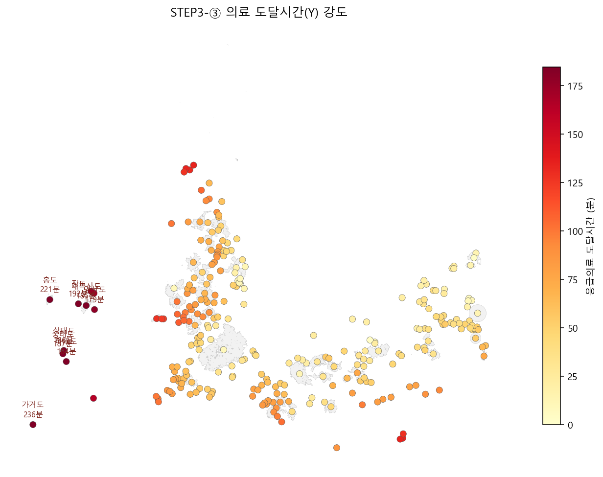
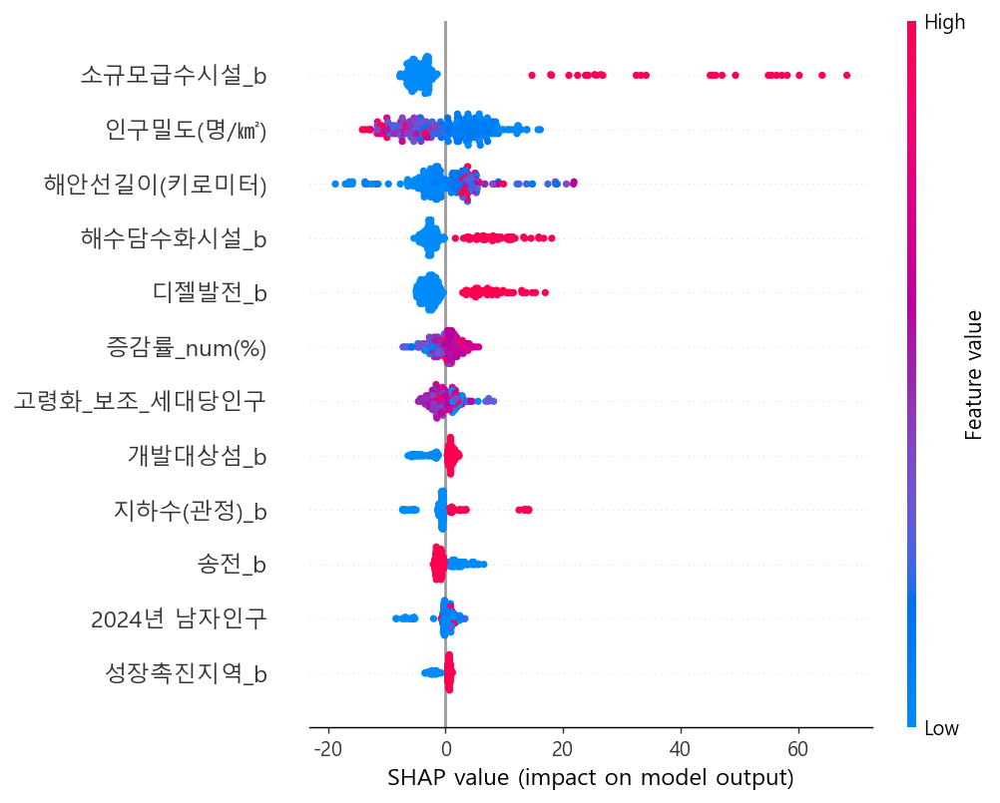
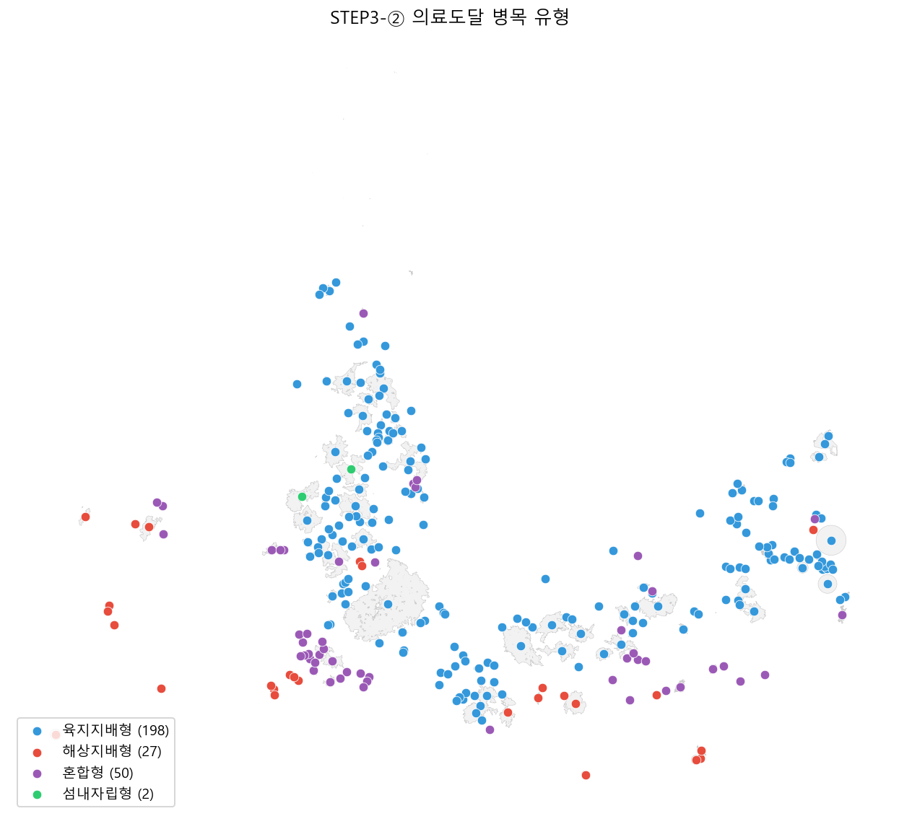
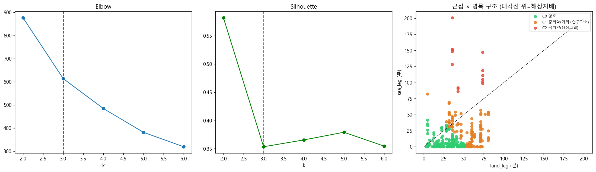
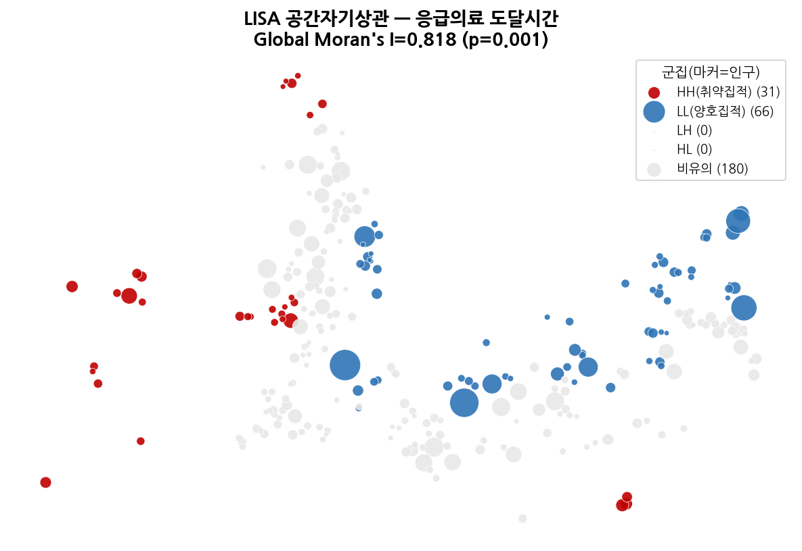
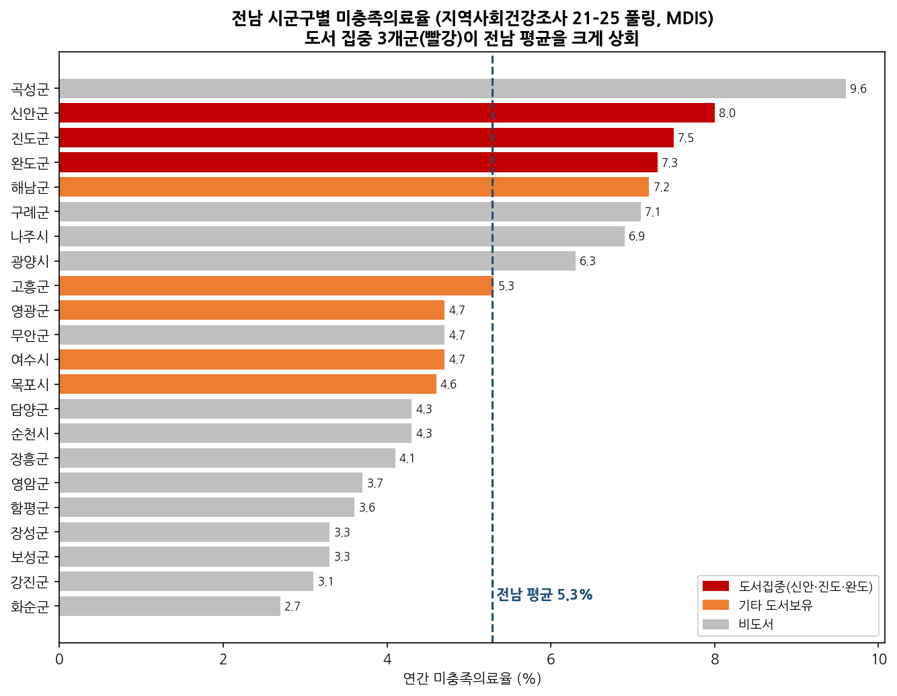
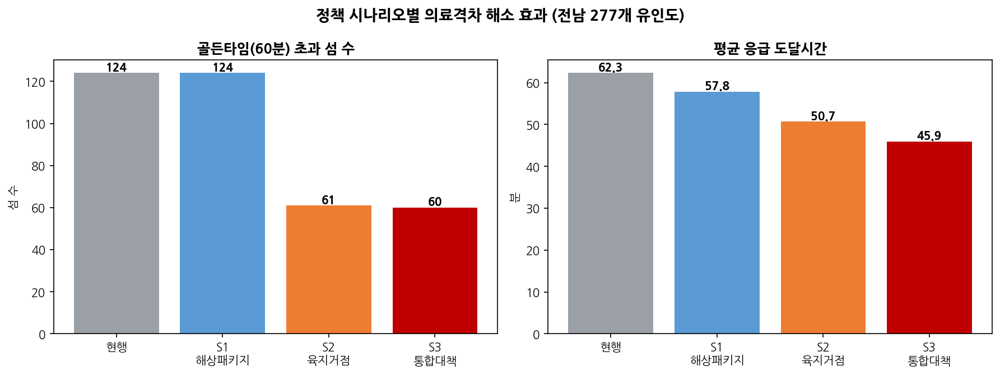
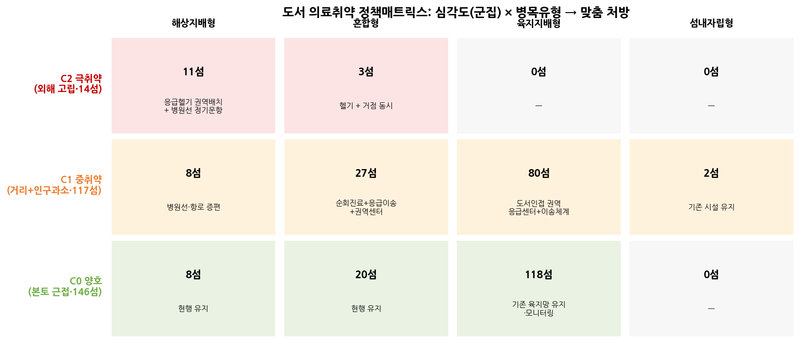

# 전남 유인도 응급의료 도달시간 진단과 유형별 정책 처방

## 1. 배경

□ 주제 선정

우리나라 응급의료체계는 국민 누구나 사는 곳과 무관하게 필요한 의료를 제때 받을 수 있어야 한다는 공평성을 원칙으로 삼는다. 그러나 섬으로 이루어진 지역에서는 이 원칙이 현실에서 잘 지켜지지 않는다. 전라남도에는 유인도만 277개가 있고, 이는 전국 섬의 59.5%에 해당한다(한국섬진흥원, 2025). 약 15.6만 명이 이 섬들에 거주하는데, 섬 안에 의원·보건지소·보건진료소가 하나도 없는 의료공백 섬이 168개(60.6%)에 이른다. 섬은 육지와 끊겨 있고 면적이 좁아 의료시설을 두기 어렵다. 환자는 본토 병원까지 배와 차를 갈아타며 이동해야 하고, 그 과정의 신체적·심리적·경제적 부담이 크다. 전남은 2011년 전국에서 처음으로 닥터헬기를 도입했지만, 유인도서 232곳 가운데 헬기가 뜨고 내릴 인계점을 갖춘 섬은 70곳, 30.2%에 그친다(보건복지부, 2025). 응급의료 접근성 문제가 단순한 거리 문제가 아니라 실제 이송체계의 문제임을 보여 주는 대목이다.

문제를 키우는 요인은 크게 세 가지다. 먼저 인구 구조다. 전남의 65세 이상 인구 비율은 27.18%로 전국에서 가장 높고(전라남도, 2025), 섬 지역은 그 평균을 다시 웃돈다. 고령 인구가 많을수록 심뇌혈관질환이나 외상처럼 분초를 다투는 응급 수요가 늘지만, 정작 의료 자원은 섬 안에서 충당되지 못한다. 다음은 섬이라는 지리적 조건이다. 2025년 1월 시행된 「국토외곽 먼섬 지원 특별법」이 흑산도를 비롯한 43개 섬을 지원 대상으로 지정한 것도, 항로·인계점·이송망의 공백을 메우려는 조치다. 마지막은 기존 접근성 지표의 한계다. 지금까지의 지표는 대체로 본토에서 얼마나 먼가라는 물리적 거리에 초점을 맞춰 왔다. 거리는 누가 그 섬에 살고 있으며, 그 사람이 실제로 어떤 경로를 거쳐 병원까지 가야 하는지를 말해 주지 않는다. 배로만 닿는 섬은 도로망에 연결되지 않아 국토통계 접근성 자료조차 비어 있다. 전남 277개 섬의 국토통계 응급의료 접근성을 확인한 결과, 216개 섬이 값을 직접 산출할 수 없는 무자료 상태였다. 측정되지 않으니 정책 대상에서도 빠지는, 통계의 사각지대인 셈이다.

□ 분석 필요성(문제점) 및 전략

의료 접근성을 다룬 지리학 연구는 시설까지의 거리나 최적 입지를 규명하는 데 집중해 왔다(Guagliardo, 2004; Luo & Wang, 2003). 물리적 거리를 지표로 삼는 방식은 구조를 설명하는 데 유용하지만, 섬처럼 해상 이동과 육상 이동이 겹치는 곳에서는 한계가 분명하다. 일본 나가사키 상五島(가미고토) 지역을 분석한 中村(2014)도 같은 출발점에서, 거리뿐 아니라 의료 서비스의 규모·질과 헬기·원격진료 같은 대체 수단까지 함께 봐야 공평성 논의가 성립한다고 지적한다. 응급의료처럼 시간이 곧 생존을 좌우하는 영역에서는 거리뿐 아니라 실제 도달시간, 그리고 그 시간을 감당하는 인구의 특성까지 동시에 살펴야 한다.

본 연구는 전라남도 277개 유인도를 한 곳도 빠뜨리지 않고 분석 단위에 넣는다. 응급의료시설에 이르는 총 도달시간(Y)을 새로 정의하고, 도로망 단절로 비어 있던 216개 섬의 값을 복원한다. 도달시간을 해상 구간과 육지 구간으로 나누어 병목을 가르고, K-means 군집분석으로 양호·중취약·극취약 세 계층을 만든다. Moran's I와 LISA로 취약성이 공간적으로 뭉치는지 검증하고, MDIS 지역사회건강조사로 수요를 교차 확인한다. 마지막으로 해상 패키지·육지 거점·통합대책 세 시나리오의 효과를 정량 비교한다. 목적은 취약 섬을 나열하는 데서 그치지 않고, 어느 섬에 어떤 정책을 먼저 적용해야 하며 그 효과가 어느 정도인지까지 제시하는 것이다.

## 2. 데이터 분석

□ 데이터 선정(사용한 데이터 및 이유 등)

분석의 기본 단위는 읍면동이 아니라 섬코드 기준 277개 유인도이다. 행정안전부 통계(2024)에 따르면 전국 유인도 479개 가운데 전남이 277개(57.9%)를 차지한다. 같은 면 안에 본섬·외해 섬·부속 섬이 함께 묶이면 읍면동 평균은 실제 취약성을 가린다. 동명이섬이 17건 있어 모든 자료는 섬코드로만 결합하였다.

본 연구는 공간·교통·의료 공급·의료 수요·인구 구조를 아우르는 여섯 종류의 국가·공공데이터를 섬 단위로 통합하였다. 전라남도 유인도정보는 인구·면적·시설·육지 연결 여부 등 277개 섬의 기본 속성을 제공하는 중심 자료이다. 국토통계 500m 접근성 격자는 보건기관·의원·응급의료시설까지의 도로 접근성을 2020년부터 2023년까지 담고 있어 육지 구간 시간 산정에 쓰였다. 국토교통부 AL_D158 섬 경계 자료는 격자와 섬을 공간적으로 연결하는 데 사용하였다. 여객선 운항·소요시간 자료는 해상 접근성의 보조 검증에 활용하였다. MDIS 지역사회건강조사는 시군구별 미충족의료율 등 수요 지표를 제공하며, 대회 필수 요건인 SDC/MDIS 자료 요건을 이 지표로 충족하였다. KOSIS 주민등록인구 자료는 고령화율·후기고령 비율을 반영하는 데 쓰였다.

| 자료 | 주요 내용 | 출처·시계열 | 분석상 역할 |
|---|---|---|---|
| 전라남도 유인도정보 | 인구, 면적, 시설, 연결성, 좌표 | 행정안전부, 2024 | 277섬 기본 속성 |
| 국토통계 500m 접근성 격자 | 보건기관·의원·응급의료시설 도로 접근성 | 국토교통부·통계청, 2020–2023 | 육지 구간 시간 산정 |
| AL_D158 섬 경계 | 섬 polygon | 국토교통부, 2026 | 격자–섬 공간 결합 |
| 여객선 운항·소요시간 | 항로, 운항편수, 소요시간 | 해양수산부, 2024 | 해상 접근 검증(보조) |
| MDIS 지역사회건강조사 | 미충족의료율, 만성질환, 주관건강 | 통계데이터센터, 2021–2025 | 수요 검증(필수) |
| KOSIS 주민등록인구 | 고령화율, 후기고령 비율 | 통계청, 2024 | 고령 수요 반영 |

MDIS 미충족의료율은 질병관리청 정의상 「최근 1년간 병·의원(치과 제외)에 가고 싶었으나 가지 못한 사람의 비율」이다(KOSIS e-지방지표).

□ 데이터 분석(분석 프로세스, 분석방법, 접근방법 등)

분석은 공간 결합, 복합 도달시간 산정, 원인·유형 분석, 공간·정책·수요 검증의 네 단계로 진행하였다.

유인도정보의 위·경도를 EPSG:5179 좌표계로 변환한 뒤 AL_D158 섬 경계와 공간조인(within → nearest)을 수행하였다. 경계 shapefile에는 행정 섬코드가 없어 좌표를 매개로 격자와 섬을 연결하였다. 277개 섬 가운데 275개가 직접 또는 근접 방식으로 매칭되었고, 나머지 2개는 대표점과 면적 정보로 보정하였다. 이후 500m 격자 중심점이 섬 polygon 안에 들어가는지 확인해 long-format 매핑표(6,755격자)를 만들었고, 277개 섬 모두가 최소 1개 이상의 격자를 갖도록 하였다.

응급의료 총 도달시간(Y)은 국토통계 접근성이 비거나 현실을 반영하지 못하는 배로만 닿는 섬을 위해 다음과 같이 정의하였다.

`Y_time_emergency = min(섬내 의료시설 이용시간, 해상 이동시간 + 육지 이동시간)`

해상 이동시간은 최근접 육지까지의 직선 해상거리를 평균 선속 30km/h로 환산하였고, 육지 이동시간은 상륙지 격자의 응급의료 접근거리(km)를 도로 속도 40km/h로 환산하였다. 섬 안에 응급의료 기능을 가진 시설이 있는 경우에는 섬내·외부 경로 중 더 짧은 값을 사용하였다. 여객선 실측 소요시간은 중간 기항지에 항로 전체 시간이 붙어 과대추정되는 문제(예: 시하도 600분)가 있고, 거리 기반 해상 구간과의 상관이 r≈0.2에 그쳐 검증용으로만 두었다. Y의 직접 구성요소(거리·페리·접근성·섬내 시설)는 설명변수에서 제외해 데이터 누수를 막았다. 이 방식으로 기존 자료에서 비어 있던 216개 섬의 값을 복원하고, 277개 섬 전부에 결측 없는 도달시간을 산출하였다.

<b>그림 1.</b> 전남 277개 유인도의 응급의료 도달시간 강도. 서남부 외해로 갈수록 도달시간이 길어진다.

원인 분석에서는 OLS(VIF>10 반복 제거)와 Random Forest(OOB R²=0.463)로 설명변수를 탐색하고, SHAP 값으로 변수의 방향을 확인하였다. 도달시간을 해상·육지 구간으로 나누어 병목을 분해한 뒤 해상지배형·육지지배형·혼합형·섬내자립형으로 분류하였다. `sea_leg_min`, `land_leg_emergency_min`, `Y_time_emergency`, `인구밀도`, `dist_main_km` 다섯 변수를 표준화한 K-means(k=3)로 C0·C1·C2 군집을 만들었다. 실루엣 지수는 k=2에서 가장 높았으나, 정책 해석 가능성을 고려해 k=3을 채택하였다.

<b>그림 2.</b> SHAP 분석 결과. 소규모급수·해수담수화·인구밀도 등 고립도를 나타내는 변수가 상위에 나타난다.

군집·병목·도달시간 강도·C1 이중취약군을 지도화하고, S1~S3 정책 시나리오로 골든타임(60분) 초과 섬·인구·평균 도달시간의 변화를 계산하였다. KNN(k=6) Moran's I·LISA로 공간 집적을 검증하고, MDIS·KOSIS를 시군구 단위로 결합해 공급 진단을 수요 측면에서 교차 확인하였다.

□ 분석 결과 및 해석

전남 유인도의 평균 응급의료 도달시간은 62.3분(중앙값 54.3분)이었다. 응급의료 골든타임으로 자주 언급되는 60분을 넘는 섬은 124개였고, 여기에 거주하는 인구는 36,965명으로 추정되었다. 가장 취약한 섬은 신안군 가거도로 236.4분이 소요되었고, 홍도 220.7분, 장도 192.1분, 중태도 187.4분, 상태도 186.5분이 뒤를 이었다. 상위 취약 섬은 대부분 신안 외해에 집중되어 있었다. 이는 의료시설 수가 적기 때문만이 아니라, 본토까지의 해상 이동과 이후 육지 의료망 접근이 겹치는 구조임을 보여 준다.

병목 유형을 보면 육지지배형이 198개(71%)로 가장 많았다. 전체 평균으로는 육지 구간(41.6분)이 해상 구간(20.9분)보다 길어, 다수 섬에서는 상륙 이후 본토 의료거점까지의 이동이 더 큰 부담으로 작용한다. 그러나 가거도·홍도·장도 등 최상위 취약 섬은 모두 해상지배형으로 분류되었다. 전남 도서 의료취약성은 두 층으로 읽어야 한다. 평범한 다수의 섬에서는 육지 쪽 의료거점과 이송체계가 병목이고, 외해에 고립된 극소수 섬에서는 해상 이동 자체가 가장 큰 병목이다.

<b>그림 3.</b> 병목 유형 분포. 다수 섬은 육지지배형이지만, 최상위 취약 섬은 해상지배형으로 나타난다.

원인 분석에서 먼섬특별법 변수는 정책 라벨에 가까워 SHAP 해석에서 제외하였다. 남은 상위 변수는 소규모급수시설, 해수담수화시설, 인구밀도, 디젤발전 등으로, 의료시설 자체라기보다 육지 인프라와의 단절·고립을 나타내는 신호로 해석하는 것이 타당하다. 中村(2014)이 지적하듯, 이런 변수는 직접 개입의 레버라기보다 취약 섬을 선별하는 지표로 쓰는 편이 맞고, 실제 정책 처방의 근거는 병목 분해에서 나온다.

K-means 군집분석 결과 277개 섬은 세 계층으로 나뉘었다.

| 군집 | 섬수 | 평균Y(분) | 특성 |
|------|------|-----------|------|
| C0 양호 | 146 | 36.3 | 본토 근접 |
| C1 중취약 | 117 | 81.1 | 육지 거리·인구과소 이중취약 |
| C2 극취약 | 14 | 177.0 | 외해 고립·해상지배 |

C0 양호군 146개 섬의 평균 도달시간은 36.3분으로, 본토와 가깝거나 육지 의료망을 비교적 빠르게 이용할 수 있는 섬이 여기에 속한다. C1 중취약군 117개 섬은 평균 81.1분으로, 육지 접근시간이 길고 인구밀도가 낮아 거리와 인구과소가 겹친 이중취약 구조를 보인다. 고정 시설을 모든 섬에 두기 어렵기 때문에 순회·이동형 의료와 응급이송 체계가 더 현실적인 대안이 된다. C2 극취약군 14개 섬은 평균 177.0분으로, 가거도·홍도·대흑산도처럼 외해에 위치한 섬이 주로 포함되며 해상 이동 병목이 뚜렷하다.

<b>그림 4.</b> K-means 기반 3계층 군집. C0(초록)는 본토 근접, C1(주황)은 거리와 인구과소가 겹친 중취약, C2(빨강)는 외해 고립 극취약으로 해석된다.

공간자기상관 분석에서도 취약성의 집적이 확인되었다. Global Moran's I는 0.818(p=0.001)로, 응급의료 도달시간이 무작위로 흩어져 있지 않고 공간적으로 강하게 군집되어 있음을 보여 준다. LISA 분석에서는 HH(취약집적) 31개 섬이 확인되었고, 이들은 주로 신안 서남부 외해권에 분포하였다. 취약 섬을 개별 섬 단위로만 볼 것이 아니라, 해역권 단위의 응급의료 네트워크로 접근해야 함을 시사한다.

<b>그림 5.</b> LISA 분석 결과. HH(빨강) 31개 섬이 외해권에 집중되어 취약성이 공간적으로 모여 있음을 보여 준다.

공급 측 진단을 수요 측면에서 뒷받침하기 위해 MDIS 지역사회건강조사를 결합하였다. 도서가 집중된 신안·진도·완도 3개군의 미충족의료율은 각각 8.0%, 7.5%, 7.3%로, 전남 22개 시·군·구 평균(5.3%)을 모두 웃돌았다. 도달시간이 긴 곳과 실제로 의료를 받지 못한 주민이 많은 곳이 공간적으로 맞닿는다. 이는 본 진단이 공급 측면만의 산술이 아니라 주민 체감과도 연결됨을 뜻한다.

<b>그림 6.</b> 전남 시군구별 미충족의료율. 도서 3개군(빨강)이 전남 평균(점선)을 상회한다.

정책 시뮬레이션 결과, 통합대책의 효과가 가장 컸다. 현행 기준으로 골든타임 60분을 초과하는 섬은 124개, 노출 인구는 36,965명, 평균 도달시간은 62.3분이었다.

| 시나리오 | 초과 섬 | 초과 인구 | 평균Y(분) | 섬 감소 | 인구 감소 |
|----------|---------|-----------|-----------|---------|-----------|
| 현행 | 124 | 36,965 | 62.3 | — | — |
| S1 해상패키지(헬기·병원선) | 124 | 36,965 | 57.8 | 0.0% | 0.0% |
| S2 육지거점(권역응급센터) | 61 | 12,749 | 50.7 | 50.8% | 65.5% |
| S3 통합대책 | 60 | 12,652 | 45.9 | 51.6% | 65.8% |

S1은 평균 도달시간만 7.2% 줄였을 뿐 골든타임 초과 섬 수는 124개로 변하지 않았다. 외해 극취약섬의 절대 시간은 헬기·병원선이 크게 줄이지만, 초과 섬 '개수'를 줄이는 데는 육지측 권역응급센터가 더 효과적이었다. S2·S3는 초과 섬을 각각 50.8%, 51.6%, 초과 인구를 65.5%, 65.8%, 평균 도달시간을 18.6%, 26.3% 줄였다. 해상 이동 개선과 육지 응급의료거점 강화는 대체 관계가 아니라 보완 관계이며, 둘을 함께 적용하는 S3 통합대책이 섬 수·인구·평균 도달시간 모두에서 최대 효과를 보였다.

<b>그림 7.</b> 정책 시나리오별 효과. S3 통합대책이 섬 수·인구·평균 도달시간 모두에서 가장 큰 개선을 보인다.

## 3. 분석 활용 전략

□ 기대효과

본 연구는 도로망 단절로 국토통계 접근성이 비어 있던 216개 섬의 응급의료 도달시간을 해상·육지 이동을 결합해 전수 산출하였다. 측정되지 않아 정책 논의에서 빠지기 쉬웠던 섬을 데이터 위로 올려, 사각지대를 줄이는 데 기여한다.

같은 '취약'이라는 이름 아래에서도 병목 원인은 다르다. 해상지배형 27개 섬에는 항로 개선, 병원선, 닥터헬기, 야간·악천후 이송체계가 우선되어야 한다. 육지지배형 198개 섬에는 섬에서 본토로 나온 뒤 도달하는 권역응급의료센터의 위치와 이송시간을 줄이는 정책이 더 효과적이다. 혼합형 50개 섬은 해상과 육지 구간을 동시에 개선해야 한다. 中村(2014)이 일본 상五島에서 보여 준 것처럼, 섬마다 다른 정책 레버를 써야 한정된 예산이 새지 않는다.

시뮬레이션은 이런 처방의 효과를 숫자로 말하게 한다. S3 통합대책을 적용하면 골든타임 초과 인구가 36,965명에서 12,652명으로 줄어든다(65.8% 감소). 초과 섬 수도 124개에서 60개로 절반 가까이 줄어든다. 지원이 필요하다는 선언을 넘어, 어떤 조합의 정책이 어느 정도의 접근성 개선을 만들 수 있는지 제시한다.

<b>그림 8.</b> 군집 심각도와 병목 유형을 결합한 정책매트릭스. 섬별 취약 원인에 따라 서로 다른 정책 처방을 제안한다.

□ 방향제시

C2 극취약군 14개 섬(평균 177분)에는 해상 이송 중심의 특별대책이 필요하다. 가거도·홍도·대흑산도 등 외해 고립 섬이 여기에 속한다. 닥터헬기 인계점 확충, 병원선 정기운항, 야간 응급이송 협약, 기상 악화 시 대체 이송체계가 우선되어야 한다. S1 해상패키지만으로는 골든타임 초과 섬 수가 줄지 않는다는 시뮬레이션 결과가 이를 뒷받침한다.

C1 중취약군 117개 섬(평균 81분)에는 육지 응급의료거점과 순회·이동형 진료를 결합한 정책이 필요하다. 육지 접근시간이 길고 인구밀도가 낮아, 모든 섬에 고정 시설을 두기는 어렵다. 정기 순회진료, 방문간호, 이동형 진료소, 응급환자 사전등록, 인접 항구와 권역응급센터 간 이송시간 단축이 현실적인 대안이 된다. 거리와 인구과소가 겹친 이중취약 구간이므로, 정책 우선순위에서 별도 관리가 필요하다.

C0 양호군 146개 섬(평균 36분)은 대규모 신규 투입보다 기존 육지 의료망 유지와 분기별 접근성 모니터링이 적합하다. 평균 도달시간이 낮다고 해서 위험이 없는 것은 아니다. 고령화, 의료기관 폐업, 여객선 운항 변화가 발생하면 접근성은 빠르게 나빠질 수 있다.

LISA 분석에서 취약성이 외해권에 집적되어 나타난 만큼, 섬 하나하나를 별도로 지원하는 방식보다 해역권 단위로 묶어 설계하는 것이 효과적이다. 외해권에는 헬기·병원선·거점항을 묶은 응급이송권역을 설정하고, 본토 인접권에는 육지 응급의료기관 접근시간을 줄이는 방향으로 정책을 설계할 수 있다.

향후 분석에서는 실시간 운항과 결항 정보를 반영해야 한다. 본 연구는 평균 여객선 속도와 도로 이동속도 가정, 직선 해상거리를 활용했기 때문에 악천후·야간 운항 제한·실제 대기시간까지 모두 반영하지는 못했다. 항로별 결항률, 닥터헬기 인계점 위치, 119 실제 이송자료를 결합하면 외해섬 취약성이 더 또렷해질 것이다. MDIS 수요 지표는 시군구 단위라 섬 내 변이는 담지 못한다는 한계도 남는다. 그럼에도 216개 무자료 섬의 접근성을 복원하고, 진단(얼마나)–원인(왜)–처방(무엇을)–효과(얼마나 줄이나)를 한 흐름으로 연결한 점이 본 연구의 기여다.

## 참고문헌

Guagliardo, M. F. (2004). Spatial accessibility of primary care: Concepts, methods and challenges. *Primary Health Care Research & Development*, 5(3), 197-210.

Luo, W., & Wang, F. (2003). Measures of spatial accessibility to health care in a GIS environment: Synthesis and a case study in the Chicago region. *Environment and Planning B: Planning and Design*, 30(6), 865-884.

Anselin, L. (1995). Local Indicators of Spatial Association—LISA. *Geographical Analysis*, 27(2), 93-115.

Breiman, L. (2001). Random forests. *Machine Learning*, 45(1), 5-32.

Lundberg, S. M., & Lee, S. I. (2017). A unified approach to interpreting model predictions. *Advances in Neural Information Processing Systems*, 30.

中村 努 (2014). 長崎県上五島地域における医療供給体制の再編成とそのメカニズム. *人文地理*, 66(5), 405-423.

국토교통부·통계청. (2020-2023). 국토통계 국토정책지표 500m 격자 접근성 자료.

행정안전부. (2024). 전라남도 유인도정보. 공공데이터포털.

전라남도. (2024). 전남의 섬 — 전국 시·도별 섬 현황. https://islands.jeonnam.go.kr

질병관리청. (2021-2025). 지역사회건강조사. 통계데이터센터(MDIS).

통계청 KOSIS. (2024). 주민등록인구 및 e-지방지표(미충족의료율). https://kosis.kr

한국섬진흥원·행정안전부. (2025). 2025년 유인섬 현황조사(2024년 말 기준).

전라남도. (2025). 전라남도 노인인구 현황(2025.6월말 기준). 공공데이터포털.

보건복지부. (2025). 전남 유인도서 닥터헬기 인계점 현황(국정감사 자료).
